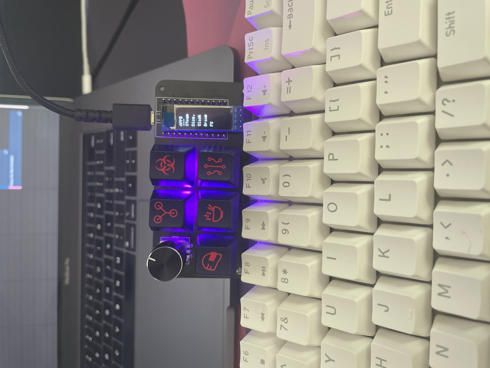

# SonBrooks Macropad 
This work in progress macropad is a simple macropad with 5 hot-swappable keys(with RGB of course), a rotary encoder, and an 128x32 OLED display. This is built on a custom PCB ran by an Arduino Pro Micro but can also be wired up without the custom PCB. 

This firmware contains the following coded layers:
* Layer Select
* Application Launch Layer
* RGB Show Layer
* Discord Control Layer (WIP)
* Programming Layer

Checkout `keymap.c` for more specifics on implementation and functionality.

# Build
5 Keys, 1 Rotary Encoder, an OLED, and a Pro Micro is all you need!

* Keyboard Maintainer: [Andrew Budziszek](https://github.com/SonnyBrooks)
* Hardware Supported: Pro Micro (ATMEGA32U4)
* Hardware Availability: All hardware can be found on Amazon.

Please reach out if you're interested in purchasing the PCB. I have a few extras I can sell and am willing to sell pre-built units as well.

# Installation
I use QMK MSYS to build the firmware using the following command:
* `qmk compile -kb sb_macro -km default`

I use the QMK Toolbox to flash my Pro Micro by enabling Autoflash and shorting the `GND` and `RST` pins for a quick second.

# QMK Tips
See the [build environment setup](https://docs.qmk.fm/#/getting_started_build_tools) and the [make instructions](https://docs.qmk.fm/#/getting_started_make_guide) for more information. Brand new to QMK? Start with our [Complete Newbs Guide](https://docs.qmk.fm/#/newbs).